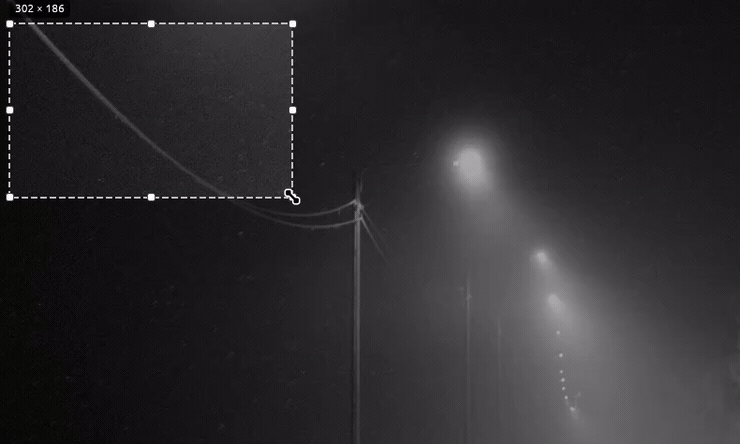

# rayshot

[](https://aur.archlinux.org/packages/rayshot)
[](https://github.com/paranoica/rayshot/actions/workflows/ci.yml)
[](LICENSE)

A fast, lightweight screenshot and annotation tool for Linux - select a region,
mark it up, copy or save. Built in Rust. Tuned for GNOME on Wayland, with an
optional resident daemon that makes capture feel instant.



## Features

- Region select across multiple monitors, with the last selection remembered.
- Annotation tools: pen, line, arrow, rectangle, marker (highlighter), text.
- Two obfuscation tools: **pixelate** (mosaic brush) and a real **blur** brush.
- Colour picker (default red), undo/redo, move/resize of the selection.
- Copy to clipboard and/or save to `~/Pictures`.
- **Instant daemon mode** on GNOME: a resident process keeps a screen-capture
  stream and the GPU warm, so the overlay appears with no portal round-trip and
  no flash. Idle cost is about 90 MB RAM and a few % CPU only while the screen
  is changing (near-zero on a static screen).

## Why rayshot?

Flameshot is the established Linux screenshot tool and does more — rayshot is
deliberately smaller, with a single focus: fast region-select and annotation on
GNOME/Wayland, in a Lightshot-like flow, with capture that feels instant.

|              | rayshot                                | Flameshot                     |
|--------------|----------------------------------------|-------------------------------|
| Focus        | GNOME/Wayland, instant capture         | Cross-platform, feature-rich  |
| Instant mode | Resident daemon, no portal flash       | Portal round-trip per shot    |
| Written in   | Rust                                   | C++                           |
| Platforms    | Linux (GNOME/Wayland focus)            | Linux, Windows, macOS         |
| Annotation   | pen, line, arrow, rect, marker, text, pixelate, blur | more tools + rich config |
| Maturity     | New                                    | Mature, large community       |

## Desktop support

The heavy part (overlay, rendering, tools) is portable across any Wayland
compositor and X11. Only the thin glue (hotkey setup, capture, animation
handling) is desktop-specific.

| Desktop                     | Status                                                                 |
|-----------------------------|------------------------------------------------------------------------|
| **GNOME (Wayland)**         | Full support: portal + instant daemon + automatic hotkey + autostart.  |
| **KDE / other Wayland**     | Works in portal mode (same capture + clipboard code). Bind the hotkey manually. |
| **wlroots (Sway/Hyprland)** | Not officially supported (the portal Screenshot backend is usually absent; `grim`-based capture is the natural path). |
| **X11**                     | Not supported.                               |

`install-hotkey` detects non-GNOME desktops and prints what to bind manually
instead of silently doing nothing.

## Requirements

Build:
- Rust toolchain (`cargo`)
- `clang` (the PipeWire bindings are generated with bindgen)
- PipeWire development headers (`pipewire` on Arch)

Runtime:
- A Wayland session with an `xdg-desktop-portal` Screenshot backend
  (`xdg-desktop-portal-gnome` on GNOME)
- `wl-clipboard` (provides `wl-copy`) for clipboard support
- `pipewire` for the daemon mode
- GNOME's `gsettings` for automatic hotkey install (GNOME only)

On Arch:

```sh
sudo pacman -S --needed rust clang pipewire wl-clipboard \
    xdg-desktop-portal xdg-desktop-portal-gnome
```

## Build

```sh
cargo build --release
# binary at target/release/rayshot
```

## Install (GNOME)

Bind `Print` to rayshot and enable instant daemon mode + autostart:

```sh
./target/release/rayshot install-hotkey --daemon
```

This rebinds `Print` to `rayshot trigger`, disables GNOME's built-in screenshot
UI on `Print` (backing it up), writes an XDG autostart entry for the daemon, and
starts the daemon now. The first run shows a "share your screen" prompt once;
the grant is remembered after that.

Without `--daemon`, `Print` runs the simpler one-shot portal mode (no resident
process, ~400 ms per capture).

Pick a different key:

```sh
./target/release/rayshot install-hotkey '<Control>Print' --daemon
```

Remove everything:

```sh
./target/release/rayshot uninstall-hotkey
```

## Usage

Press your hotkey, drag to select a region, then annotate.

Tools (toolbar or keyboard):

| Key | Tool                         |
|-----|------------------------------|
| `S` / `V` | Select / move / resize |
| `P` | Pen                          |
| `L` | Line                         |
| `A` | Arrow                        |
| `R` | Rectangle                    |
| `M` | Marker (highlighter)         |
| `T` | Text                         |
| `X` | Pixelate (mosaic)            |
| `B` | Blur                         |

Actions:

| Key | Action                                  |
|-----|-----------------------------------------|
| `Ctrl+C` / `Enter` | Copy to clipboard + keep a temp copy |
| Toolbar floppy     | Save to `~/Pictures`             |
| `Ctrl+Z`           | Undo                             |
| `Ctrl+Y` / `Ctrl+Shift+Z` | Redo                      |
| `Esc`              | Cancel                           |

The colour picker is in the toolbar; the default colour is red.

## Where screenshots go

- **Copy** (`Ctrl+C` / `Enter`): the annotated image goes to the clipboard and a
  copy is written to a scratch directory (`$XDG_RUNTIME_DIR/rayshot/`). That
  directory lives in RAM, is cleared on logout/reboot, and files older than 24 h
  are pruned on the next launch. It is a temporary cache, not an archive.
- **Save** (floppy button): a permanent file at
  `~/Pictures/rayshot-DD-MM-YYYY-HH-MM-SS.png`.

## Commands

| Command | Description |
|---------|-------------|
| `rayshot` | One-shot overlay via the screenshot portal. |
| `rayshot daemon` | Run the resident instant-capture daemon. |
| `rayshot trigger` | Tell the daemon to capture now (falls back to portal mode if no daemon is running). |
| `rayshot close` | Dismiss the daemon's overlay. |
| `rayshot shot [path]` | Capture the whole desktop to a PNG and exit (no overlay). |
| `rayshot monitors` | List detected monitors. |
| `rayshot install-hotkey [binding] [--daemon]` | Bind a key (GNOME). |
| `rayshot uninstall-hotkey` | Undo the hotkey setup. |

## Why a daemon?

On GNOME the only sanctioned capture path is the screenshot portal, which
encodes a PNG to disk and plays a flash animation — roughly 400 ms per shot,
which can't be avoided from a normal app. GNOME's own screenshot UI feels
instant only because it is the compositor and already holds the pixels.

The daemon closes that gap: it keeps a PipeWire screen-capture stream and a
pre-initialised GPU warm, so a trigger grabs the latest frame and shows the
overlay near-instantly, without the portal round-trip or the flash. It copies
only a few frames per second and converts none until you trigger, so it sits at
about 90 MB RAM (much of it screen-capture buffers shared with the compositor)
and a few % CPU while the screen changes, near-zero when static.

## Environment variables

| Variable | Effect |
|----------|--------|
| `RAYSHOT_KEEP_ANIMATIONS` | Do not toggle GNOME animations around a capture. |
| `RAYSHOT_NODIM` | Do not dim the area outside the selection. |

## License

MIT — see [LICENSE](LICENSE).
